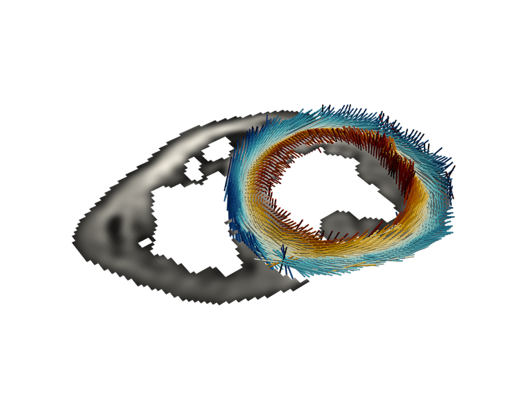
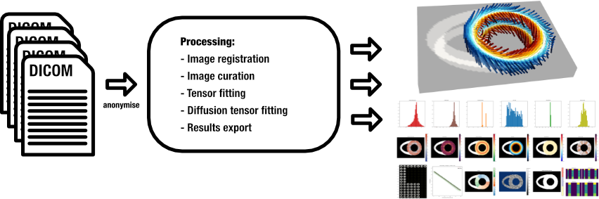
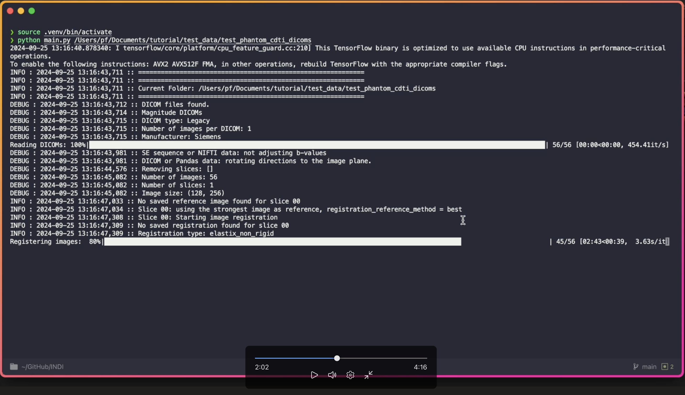

# INDI (in-vivo diffusion)

<p align="center">

</p>

<p align="center">
In-vivo diffusion analysis (INDI)<br>
Post-processing pipeline for in-vivo cardiac diffusion tensor imaging.
</p>

## Table of Contents

- [Introduction](#introduction)
- [Installation](#installation)
- [How to](#how-to)
- [License](#license)
- [Aknowledgements](#aknowledgements)

## Introduction

This software is a post-processing pipeline designed for in-vivo cardiac diffusion tensor imaging.
It currently accepts Siemens and Philips diffusion weighted DICOM data, as well as [anonymised NIFTI data](https://github.com/ImperialCollegeLondon/cdti_data_export).
It also supports both STEAM and spin-echo data.

After the data is loaded, the pipeline performs the following steps:

- Image registration
- Image curation
- Tensor fitting
- Segmentation
- Export results



INDI runs from the command line, and when processing a dataset for the first time,
INDI will require user input (pop-up matplotlib windows) which will be saved for future runs.

For more details:

See [documentation](docs/documentation.md) for details on the post-processing pipeline.

See [YAML settings](docs/YAML_settings.md) for run configuration details.

## Installation

Software has been tested on:

- macOS 15.0 with python 3.12
- Ubuntu 24.04 with python 3.12
- Windows 10 with python 3.12

### Clone the repository

[Install git for your OS](https://git-scm.com/book/en/v2/Getting-Started-Installing-Git).

Then clone the repository.

```bash
git clone https://github.com/ImperialCollegeLondon/INDI.git
```

---

### Installation in macOS (Intel and Apple silicon)

You may need to instal Xcode and Xcode’s Command Line Tools package as well, with this command:

```bash
xcode-select --install
```

Then install [homebrew](https://brew.sh/).

With homebrew install python 3.12:

```bash
brew install python@3.12
```

Also install imagemagick:

```bash
brew install imagemagick
```

Install the python environment in the INDI root directory:

```bash
python3.12 -m venv .venv
source .venv/bin/activate
pip install .
```

---

### Installation in Ubuntu 24.04

install imagemagick:

```bash
sudo apt install imagemagick
```

install development tools:

```bash
sudo apt install git-all
sudo apt install build-essential
sudo apt install python3.12-venv
sudo apt-get install python3-tk python3-dev
```

Create the python environment in the INDI root directory:

```bash
python3 -m venv .venv
source .venv/bin/activate
pip install .
```

You may need to allow the display to show matplotlib windows with the following terminal command:

```bash
xhost +
```

---

### Installation Windows 10 with conda

Install miniforge:
[Miniforge](https://github.com/conda-forge/miniforge)

Create a new environment with conda:

```bash
conda create --name indi python=3.12
conda activate indi
```

Then install the required packages:

```bash
pip install .
```

Install [imagemagick](https://imagemagick.org/).

---

### Installing optional AI modules (experimental)

We have automatic an automatic segmentation module. More details on how to configure it are in `docs/documentation.md`.
To use them you first need to install the AI optional dependencies with:

```bash
pip install ".[ai]"
```

### For development

Install INDI in editable mode with optional dependencies

```bash
pip install -e ".[dev]"
```

#### Install pre-commit

```bash
pre-commit install
```

Now pre-commit will run automatically on git commit. You can also run it manually with:

```bash
pre-commit run --all-files
```

This is required to ensure code quality and style before committing code changes.

#### Update requirements

The packages are pinned to specific versions in the `requirements.in` file. If you want to update the packages, you can do so with the following command (change the requirements file name according to the OS):

```bash
pip-compile --output-file=requirements_mac.txt
pip-sync requirements_mac.txt
```

---

## Basic usage example

We are going to post-process a synthetic phantom dataset with non-rigid distortions. Please unzip [the phantom data](docs/test_phantom_cdti_dicoms.zip).

The `test_phantom_cdti_dicoms` folder contains a subfolder named `diffusion_images` with the cdti simulated DICOMs. The DICOM files contain noisy diffusion weighted images with periodic non-rigid distortions, simulating a typical in-vivo scan.

INDI always looks recursively for subfolders named `diffusion_images`. The DICOM files must be inside this folder.

Before running we should have a look at the `settings.yaml` file, and check if the parameters makes sense. See [YAML settings](docs/YAML_settings.md) for more information. Change the start_folder field to the path for the data. For this phantom example, the default settings should be fine.

Then run in the INDI python environment:

```bash
indi /path/to/settings/file
```

Where `<data_path>` is a folder that must contain at least a subfolder named `diffusion_images` with all the
DICOM files.

In the video tutorial below we show how to run INDI with the phantom data:

[](https://1drv.ms/v/s!Ah-7Qw9tn52siW8SQZYX0RjRPdKG?e=Pwq85B)

## License

INDI is licensed under the terms of the BSD license. Please see the [LICENSE](LICENSE) file.

If you use this software, please credit this website and "**The CMR unit,
Royal Brompton Hospital**".

## Aknowledgements

- Royal Brompton Hospital (Guy's and St Thomas' NHS Foundation Trust), London UK.
- Imperial College, London UK.
- This work was supported by the British Heart Foundation RG/19/1/34160 and RG/F/23/110115.
- Chan Zuckerberg Initiative DAF, an advised fund of the Silicon Valley Community Foundation: 2024-337787.
- EPSRC Healthcare Technologies EP/X014010/1.


