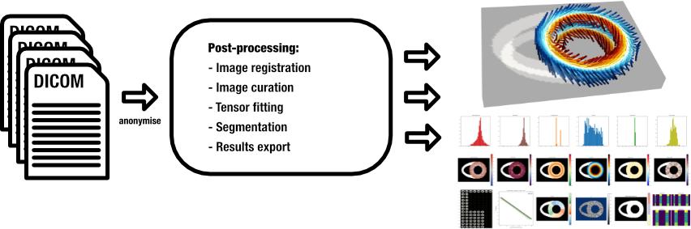
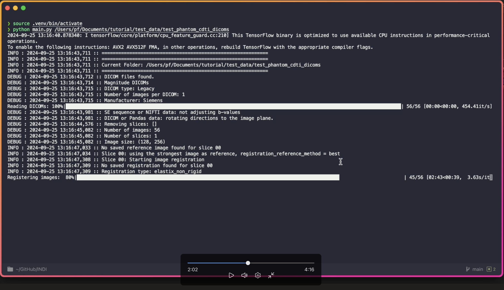

# INDI (In-Vivo Diffusion)

<p align="center">

</p>

<p align="center">
In-vivo diffusion analysis (INDI)<br>
A post-processing pipeline for in-vivo cardiac diffusion tensor imaging.
</p>

## Table of Contents

- [Introduction](#introduction)
- [Installation](#installation)
	- [Quick start](#quick-start-any-os)
	- [Clone the repository](#clone-the-repository)
	- [macOS](#installation-on-macos-intel-and-apple-silicon)
	- [Ubuntu](#installation-on-ubuntu-2404)
	- [Windows (Conda)](#installation-on-windows-10-with-conda)
	- [Optional AI modules](#installing-optional-ai-modules-under-development-)
- [For Development](#for-development)
	- [Documentation](#documentation)
	- [pre-commit](#install-pre-commit)
- [Basic Usage](#basic-usage-example)
- [License](#license)
- [Acknowledgements](#acknowledgements)

## Introduction

INDI is a Python-based post-processing pipeline for in-vivo cardiac diffusion tensor imaging (cDTI). It supports Siemens, Philips, GE and United Imaging diffusion-weighted DICOMs, plus [anonymised NIFTI data](https://github.com/ImperialCollegeLondon/cdti_data_export). Both STEAM and spin-echo sequences are handled.

What it does:

- Image registration
- Image curation and outlier handling
- Tensor fitting
- Segmentation and LV sectorisation
- Results export (VTK, HDF5, CSV, figures)



INDI is run from the command line. When processing a dataset for the first time, user input may be required (via pop-up matplotlib windows); these selections are saved for future runs.

For more information:

- See the [documentation](docs/documentation.md) for details on the post-processing pipeline (under development 🚧).
- See [YAML settings](docs/YAML_settings.md) for configuration details (under development 🚧).

## Installation

INDI has been tested on:

- macOS 15 with Python 3.12
- Ubuntu 24.04 with Python 3.12
- Windows 10 with Python 3.12

### Quick start (any OS)

```bash
git clone https://github.com/ImperialCollegeLondon/INDI.git
cd INDI
python3 -m venv .venv
source .venv/bin/activate  # or .venv\Scripts\activate on Windows
pip install .
```

### Clone the Repository

First, [install git](https://git-scm.com/book/en/v2/Getting-Started-Installing-Git) for your operating system, then clone the repository:

```bash
git clone https://github.com/ImperialCollegeLondon/INDI.git
cd INDI
```

---

### Installation on macOS (Intel and Apple Silicon)

You may need to install Xcode and its Command Line Tools:

```bash
xcode-select --install
```

Install [Homebrew](https://brew.sh/) and then Python 3.12:

```bash
brew install python@3.12
```

Install ImageMagick:

```bash
brew install imagemagick
```

Set up the Python environment in the INDI root directory:

>[!NOTE]
> For development replace the `pip install .` command below with `pip install -e ".[dev,doc]"` to install INDI in editable mode with optional dependencies.

```bash
python3.12 -m venv .venv
source .venv/bin/activate
pip install .
```

---

### Installation on Ubuntu 24.04

Install ImageMagick:

```bash
sudo apt install imagemagick
```

Install development tools:

```bash
sudo apt install git-all build-essential python3.12-venv
sudo apt-get install python3-tk python3-dev
```

Create the Python environment in the INDI root directory:

>[!NOTE]
> For development replace the `pip install .` command below with `pip install -e ".[dev,doc]"` to install INDI in editable mode with optional dependencies.

```bash
python3 -m venv .venv
source .venv/bin/activate
pip install .
```

If you encounter issues displaying matplotlib windows, run:

```bash
xhost +
```

---

### Installation on Windows 10 with Conda

Install [Miniforge](https://github.com/conda-forge/miniforge).

Create a new environment with conda:

```bash
conda create --name indi python=3.12
conda activate indi
```

Install the required packages:

>[!NOTE]
> For development replace the `pip install .` command below with `pip install -e ".[dev,doc]"` to install INDI in editable mode with optional dependencies.

```bash
pip install .
```

To allow the ImageMagick scripts to run enter command:

```powershell
Set-ExecutionPolicy -ExecutionPolicy Unrestricted -Scope LocalMachine`
```

Install [ImageMagick](https://imagemagick.org/).

---

### Installing Optional AI Modules (under development 🚧)

We provide an ensemble of U-Net models trained to segment cardiac borders in STEAM data. For details, see `docs/documentation.md` (under development 🚧).  
To use these models, install the AI dependencies:

```bash
pip install ".[ai]"
```

---

## For Development

Install INDI in editable mode with optional dependencies:

```bash
pip install -e ".[dev,doc]"
```

### Documentation

>[!NOTE]
> Documentation is very much work in progress

To serve the documentation locally:

```bash
mkdocs serve
```

#### Install pre-commit

```bash
pre-commit install
```

Pre-commit will now run automatically on each commit. You can also run it manually:

```bash
pre-commit run --all-files
```

This helps ensure code quality and style before committing changes.

---

## Basic Usage Example

To post-process a synthetic phantom dataset with non-rigid distortions, first unzip [the phantom data](docs/test_phantom_cdti_dicoms.zip).

The `test_phantom_cdti_dicoms` folder contains a `diffusion_images` subfolder with simulated cDTI DICOMs. These files include noisy diffusion-weighted images with periodic non-rigid distortions, simulating a typical in-vivo scan.  
**INDI always looks recursively for subfolders named `diffusion_images`. The DICOM files must be inside a folder with this name.**

Before running INDI, copy the [`settings_template.yaml`](settings_template.yaml) file near your data folder. This file contains default settings for the processing pipeline. Review and adjust the parameters as needed for your dataset. More information is available in [the YAML settings documentation](docs/YAML_settings.md).

In your `settings.yaml` file, set the `start_folder` option to the path containing a `diffusion_images` subfolder. For example:

```yaml
start_folder: /path/to/test_phantom_cdti_dicoms
```

Then, in your INDI Python environment, run:

```bash
indi /path/to/settings.yaml
```

Alternatively, you can leave the `start_folder` field blank and specify the path using the `--start_folder` command-line option:

```bash
indi path/to/settings.yaml --start_folder /path/to/start/folder
```

A video tutorial demonstrating how to run INDI with the phantom data is available below (note: the command shown in the video may be slightly outdated, but the rest of the content is still relevant):

[](https://1drv.ms/v/s!Ah-7Qw9tn52siW8SQZYX0RjRPdKG?e=Pwq85B)

## License

INDI is licensed under the BSD license. See the [LICENSE](LICENSE) file for details.

If you use this software, please credit this website and "**The CMR Unit, Royal Brompton Hospital**".

## Acknowledgements

- Royal Brompton Hospital (Guy's and St Thomas' NHS Foundation Trust), London, UK
- Imperial College London, UK
- Supported by the British Heart Foundation RG/19/1/34160 and RG/F/23/110115
- Chan Zuckerberg Initiative DAF, an advised fund of the Silicon Valley Community Foundation: 2024-337787
- EPSRC Healthcare Technologies EP/X014010/1


