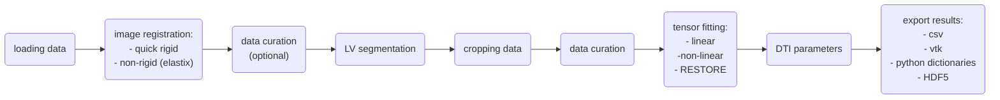

```mermaid
flowchart LR
    A(loading data)
    B("`image registration:
    - quick rigid
    - non-rigid (elastix)`")
    C("`data curation
    (optional)`")
    D(LV segmentation)
    E(cropping data)
    F(data curation)
    G("`tensor fitting:
    - linear
    -non-linear
    - RESTORE`")
    H(DTI parameters)
    I("`export results:
    - csv
    - vtk
    - python dictionaries
    - HDF5`")

    A --> B
    B --> C
    C --> D
    D --> E
    E --> F
    F --> G
    G --> H
    H --> I
```
