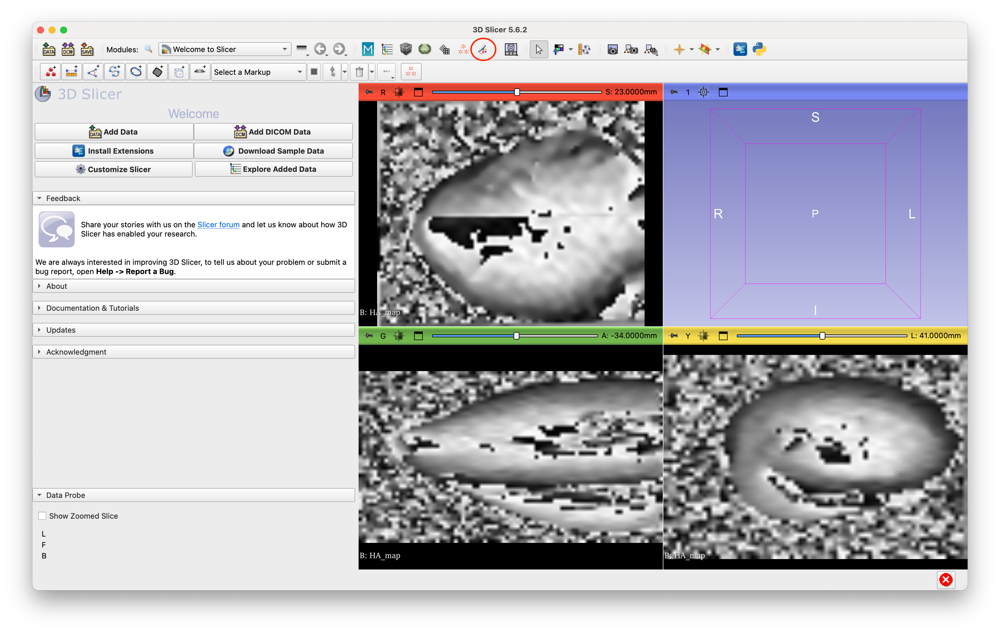
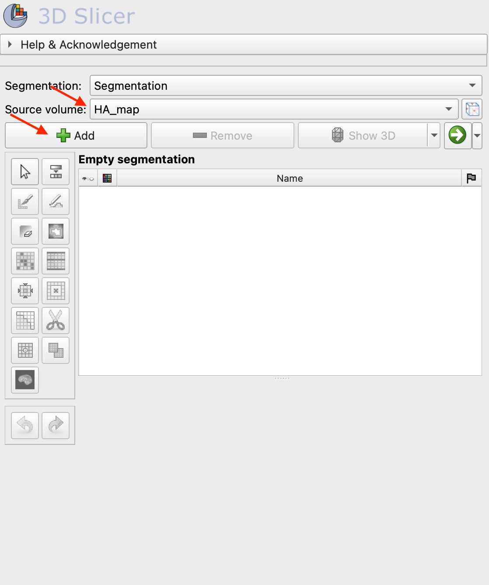
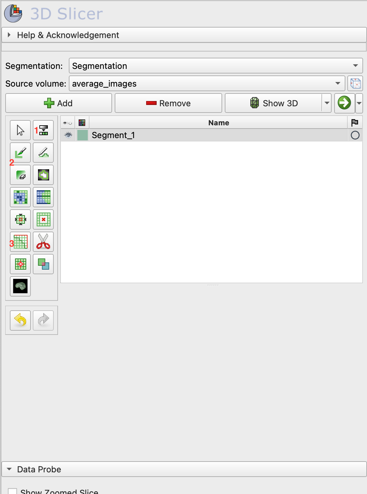
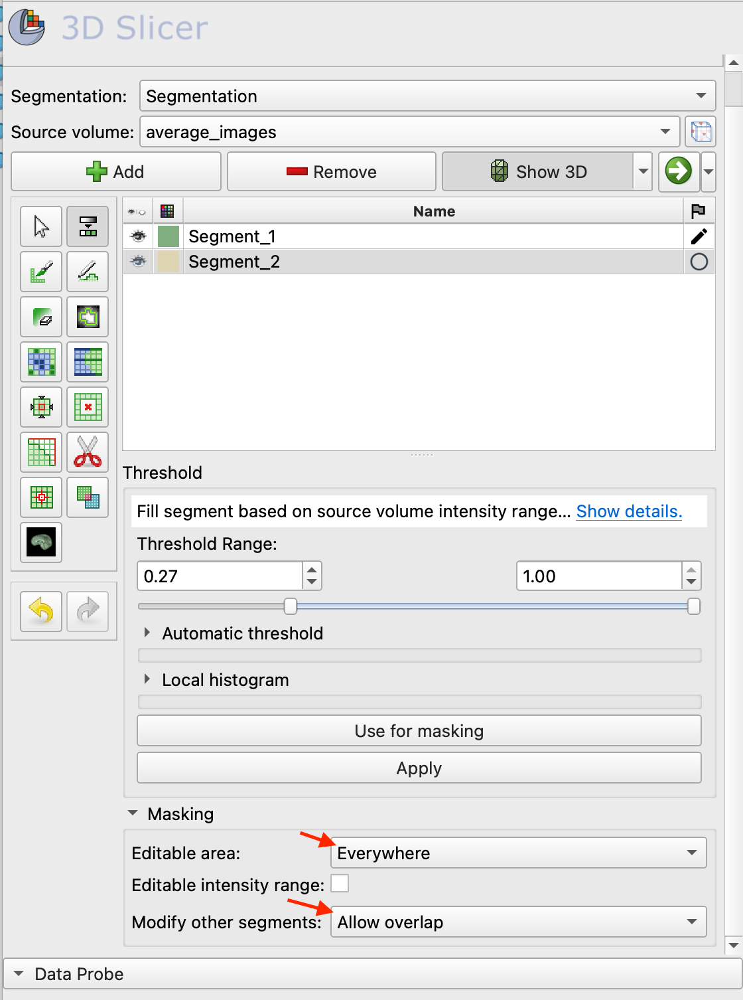
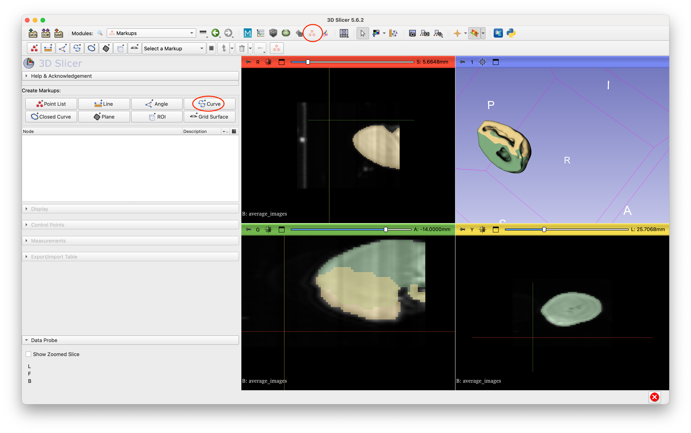
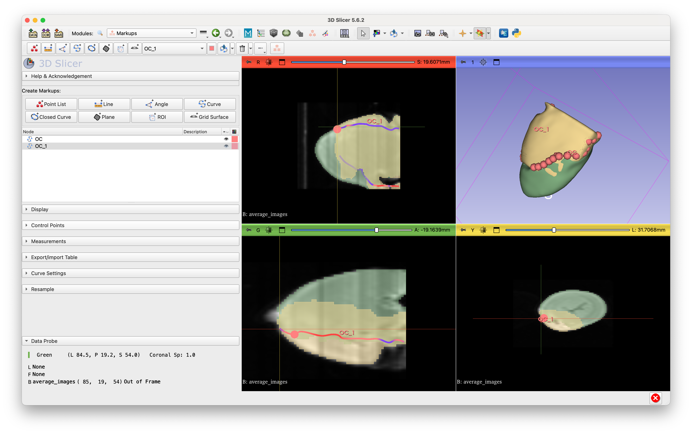

# Segmentation with 3D Slicer

[3D Slicer](https://www.slicer.org/) is an open source tool for visualization and analysis of medical images. It has a
rich support for segmentation which we can take advantage for facilitated the segmentation process. There are two types
of images that can be segmented with Slicer, whole heart and tissue blocks

## Installing 3D Slicer

Go to the the 3D Slicer website and download the latest version. Alternately you can run `brew install --cask slicer`.

>[!NOTE]
>The installation folder must be `/Applications/Slicer.app/Contents/MacOS/Slicer` (the default).

>[!WARNING]
>This feature only works on MacOS

## LV and RV segmentation for whole heart images

Running INDI as usual once it gets to the segmentation section will automatically open 3D Slicer with the volume loaded.
At the start you will see a preliminary HA map and you can change it to MD or a B_0 image.

In this mode you can define the LV, intersection points and optionally the RV.

To start the segmentation open the Segment Editor module by selecting it from the drop down menu or by clicking its
icon.

In the Segmentation Editor you can select which volume you are viewing. Start by creating a new segmentation. This will
be our LV segment.

### Select the LV

>[!NOTE]
>The left ventricle always has to be the first segment created.

Now segment the left ventricle using all the tools available. Read [this article](https://slicer.readthedocs.io/en/latest/user_guide/modules/segmenteditor.html)
from the oficial 3D Slicer documentation to familiarice yourself with the tools. The workflow could be as follow:

  1. Use the threshold tool to get a segmentation of the whole heart
  2. Using the brush and eraser tools clean up the first segmentation (remove RV, empty spaces, etc.)
  3. Smooth the segmentation using the one of the smoothing tools

### Select the RV

>[!NOTE]
>This step is optional

Create a new segment which wil became our right ventricle. This segment has to include the septum overlapping with the
LV.

To create overlapping segments you can select where the tools are allowed to modify in the bottom portion of the
settings

The workflow could be as follow

  1. Segment again all the heart
  2. Use the eraser and brush tools to remove the LV.
  3. Smooth segmentation if needed

### Select the Intersection points

The last steps is to select the intersection points between the RV and LV.

Start by selecting the Markup tools and create new curve

Put the curve points in the intersection points

Finally press `cmd+shift+s` to save the files and close 3D Slicer. Now the segmentation is finished and INDI will
continue to process the image.

## Tissue blocks segmentation

