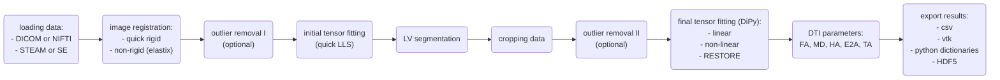

# Post-processing cardiac diffusion tensor imaging



**Diagram summarising the workflow.**

>[!WARNING]
> This page in under development.

## YAML settings

Before running the script, we need to configure the `settings.yaml` file with the correct parameters.
See [YAML settings](YAML_settings.md) for more information.

## Folder structure

The pipeline expects the following folder structure:

```text
.
└── study_01
    ├── scan_01
    │   └── diffusion_images
    │       ├── IM-0001-0001.dcm
    │       ├── IM-0001-0002.dcm
    │       ├── IM-0001-0003.dcm
    │       └── IM-0001-0004.dcm
    │       └── ...
    └── scan_02
        └── diffusion_images
            ├── series_01.bval
            ├── series_01.bvec
            ├── series_01.json
            ├── series_01.nii
            ├── series_02.bval
            ├── series_02.bvec
            ├── series_02.json
            └── series_02.nii
            └── ...
```

If we want to analyse `scan_01` and `scan_02`, we can run the following command:

```bash
python main_script.py <path to study_01>
```

Alternatively if we want to analyse only `scan_01`, we can run the following command:

```bash
python main_script.py <path to scan_01>
```

>[!WARNING]
> The DICOM or NIFTI files must always be inside a subfolder named `diffusion_images`.

## Post-processing pipeline

### Loading data

The pipeline accepts Siemens and Philips diffusion weighted DICOM data, as well as anonymised NIFTI data. It also supports both STEAM and SE sequences.

For more details on creating anonymised NIFTI files from DICOMs please have a look at [this repository](https://github.com/ImperialCollegeLondon/cdti_data_export).

If `sequence_type` is set to STEAM (YAML settings), the b0 values are adjusted to a >0 value (defined by the sequence spoilers), and then all b-values are adjusted for RR variations from the assumed value set in the protocol.

#### Adjusting b-values for the STEAM sequence

The way INDI adjusts the b-values depend on the data type and manufacturer. The current supported workflows are:

- **Siemens DICOM files:** b-values are adjusted by using information in the DICOM header, the nominal time and the comment DICOM...

---

## Experimental (only use for development and testing)

>[!WARNING]
> The following features are experimental and should only be used for testing and further development.

### AI models

We have AI models to:

- automatically segment the LV myocardium for STEAM sequences (U-Net based)
- denoise the diffusion tensor for STEAM sequences (Transformer based)

[One drive download link](https://imperiallondon-my.sharepoint.com/:f:/g/personal/pferreir_ic_ac_uk/EtbqXB1XJY9JmBJ8kFcT40sBq9qHJrVZPwrzgEcW12VwUQ?e=qqDY8C)

U-Net models need to be copied to the following path:
```/usr/local/dtcmr/unet_ensemble/```

Transformer models need to be copied to the following path:
```/usr/local/dtcmr/transformer_tensor_denoising/```

### Archive DICOMs

You will also need to create a file in the code root directory called `.env` with the following content:
`ARCHIVE_PASS=your_password`. Replace `your_password` with a robust string.
You can do this by running the following command:

```bash
echo "ARCHIVE_PASS=your_password" > .env
```

This password will be used to encrypt DICOM files locally when using the option `workflow_mode: anon`.
